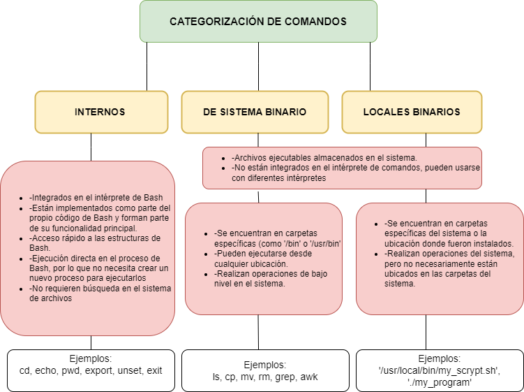

<!DOCTYPE html>
<html lang="es">
<head>
    <meta charset="UTF-8">
    <meta name="viewport" content="width=device-width, initial-scale=1.0">
</head>
<body>
    
    <h3 text align= "center">Proyecto de 42 Madrid</h3>
    <li>
        <h3>Introducción</h3>
        <h3>Instalación</h3>
        <h3>Diagramas y apuntes</h3>
        
    </li>
     
    <h2>Variables de entorno</h2>
    <h3>VARIABLES DE ENTORNO</h3>

Son variables de contienen información sobre el sistema operativo y la configuración del usuario. 
Son utilizadas por el Shell y por las aplicaciones para determinar cómo funcionan y se comportan
Se pueden definir, modificar y eliminar según las necesidades del usuario o sistema

<h4>Ejemplos de variables de entorno</h4>
<h5>PATH:</h5>

Especifica las ubicaciones donde el sistema buscará ejecutables cuando se ingresa un comando en la línea de comandos

<pre><code>PATH=/usr/local/bin:/usr/bin:/bin</code></pre>
<h5>HOME:</h5>

Indica el directorio de inicio del usuario actual

<pre><code>HOME=/home/usuario</code></pre>
<h5>USER:</h5>

Contiene en nombre del usuario actual

<pre><code>USER=Just-Think</code></pre>
<h5>SHELL:</h5>

Almacena la ruta del Shell que está utilizando el usuario actualmente

<pre><code>SHELL=/bin/bash</code></pre>
<h5>PS1:</h5>

Define el formato del prompt del shell

<pre><code>PS1='\u@\h:\w\$ '</code></pre>
<h5>LANG:</h5>

Determina la configuración regional y de idioma del usuario

<pre><code>LANG=en_US.UTF-8</code></pre>
<h5>TERM:</h5>

Define el tipo de terminal que el usuario está utilizando

<pre><code>TERM=xterm-256color
</code></pre>
 
<h3>Export</h3>

Comando que sirve para establecer variables de entorno en sistemas UNIX, lo que permite que estas variables sean accesibles por cualquier proceso hijo de Shell actual

Ejemplo:

Ejecutamos en Bash:<pre><code>export MY_VARIABLE=valor</code></pre>. Con esto, hemos creado una variable de entorno llamada<code>MY_VARIABLE</code> con un valor.

Ahora esta variable de entorno estará disponible para cualquier proceso hijo de tu Shell actual. Si luego ejecutas un script o un programa desde ese Shell, podrá acceder a <code>MY_VARIABLE</code> y su contenido

<h5>Casos difíciles</h5>

Vamos a jugar con dos variables que todavía no hemos creado

<em>*Nota: Para acceder al valor de una variable debes escribir <code>echo $MY_VARIABLE</code></em>

Si probamos a expandir <code>$a=$b</code>Nos va a dar un error, ya que a no existe y por tanto no puede acceder (expandir) ningún valor

Ahora vamos a crear de verdad una variable llamada "a". <pre><code>export a=abc</code></pre>

Ahora si expandimos nos debería dar abc (su valor)<pre><code>echo $a</code></pre>

Bien, Ahora vamos a probar a darle al valor de la variable <code>a</code> el valor de la variable <code>b</code> (b no la hemos creado)

<pre><code>export $a=$b</code></pre>

Intenta establecer una variable de entorno con el valor de otra variable de entorno. Sin embargo, hay un error en la sintaxis. <code>$a</code> se interpreta como el valor de la variable <code>a</code>, que es <code>abc</code>, y <code>$b</code> se interpreta como el valor de la variable <code>b</code>. Sin embargo, al no haberse definido <code>b</code>, <code>$b</code> será interpretado como una cadena vacía o nula. Por lo tanto, este comando intenta establecer la variable de entorno <code>abc</code> con un valor vacío o nulo.

Vamos a solucionar eso creando una variable <code>b</code>

<pre><code>export b=defghijklmno</code></pre>

y volvemos a intentarlo de nuevo con la variable <code>b</code> creada

<pre><code>export $a=$b</code></pre>

Y si hacemos esto...

<pre><code>echo $abc</code></pre>

¡Magia! Ahora <code>abc</code> expande el contenido de la variable <code>b</code>

</body>
</html>
